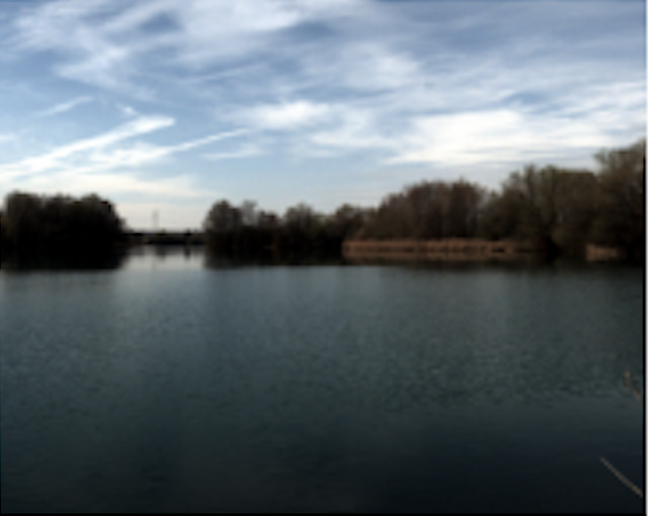
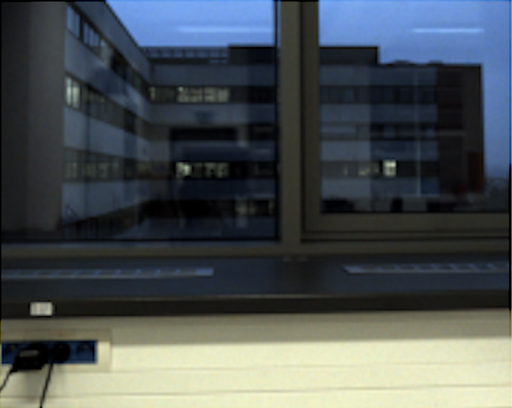
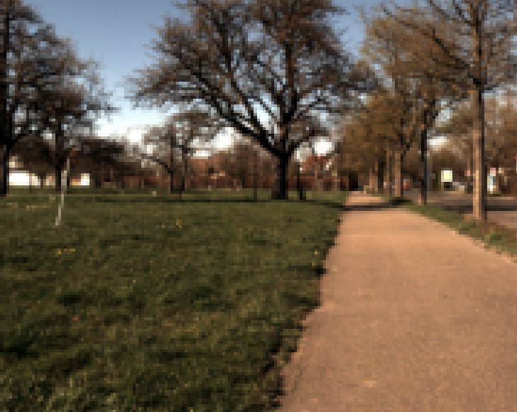
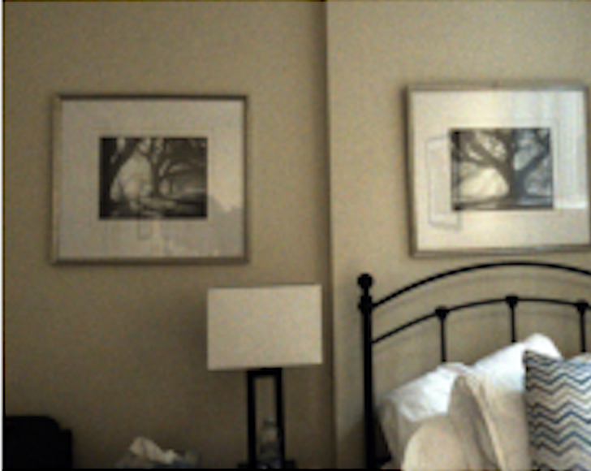

## Example Images

Here are a few representative images from the dataset.

::: {class="gallery"}
::: {.thumb}
{fig-alt="Outdoor lake scene"}
*Outdoor*
:::
::: {.thumb}
{fig-alt="Indoor scene with window"}
*Indoor w/ window*
:::
::: {.thumb}
{fig-alt="Outdoor path scene"}
*Outdoor*
:::
::: {.thumb}
{fig-alt="Indoor scene without window"}
*Indoor no window*
:::
:::

## Dataset Access

  <h3>Metadata (CSV)</h3>
  
Image-level metadata with location, view, scene, and acquisition info.

  <a class="btn" href="data/20250630_SCENES_metadata_integrated_modified.csv">Download CSV</a>
  
~2.1 MB • <code>text/csv</code>

  <h3>GoPro RAW (GPR)</h3>
  
Original GoPro RAW files (selected subset) for spectral mapping.

  <a class="btn" href="https://example.org/gopro-raw">External link</a>
  
Hosted externally

  <h3>WP690 RAW</h3>
  
Multispectral camera exports used as target LMRSI channels.

  <a class="btn" href="https://example.org/wp690-raw">External link</a>
  
Hosted externally

  <h3>Registered Pairs (PKL)</h3>
  
GoPro↔WP690 registered pairs ready for model training.

  <a class="btn" href="https://example.org/registered-pairs">External link</a>
  
Hosted externally

::: {.callout-note}
Large assets (RAW images, registered pairs) are **hosted externally** to keep this site lightweight and fast.
:::

## Recommended citation

Please cite the SCENES project when using this dataset:

> SCENES Consortium (2025). *SCENES: An International Dataset of Naturalistic Visual Environments*. DOI link coming soon.
