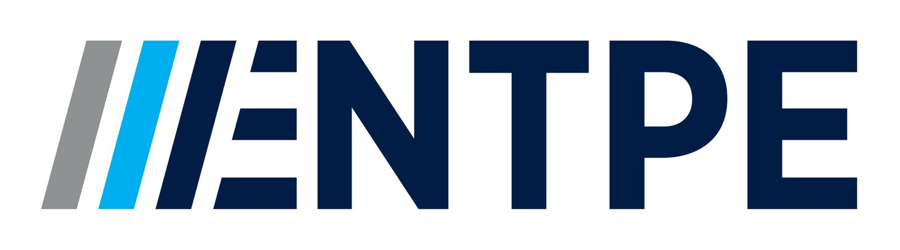

{height=150}

The SCENES Dataset is an international collaborative effort to characterize and analyze naturalistic visual environments across different geographies. The project brings together partners from around the globe to build a rich repository of spectral and spatial data.

## Where the Data Was Collected

  <iframe src="data/map.html" title="SCENES acquisition map"></iframe>

Explore the interactive map to see all acquisition sites. Pan, zoom, and click markers for details about each scene.

---

# Resources
- **Statistics:** Explore dataset distributions  
- **Download:** Data access (coming soon)  
- **Documentation:** User guide (coming soon)  

---

# Team

## Partner Institutions & Team Members

#### Technical University of Munich & Max Planck Institute for Biological Cybernetics

{height=50}
{height=50}

Niloufar Tabandeh

Prof. Dr. Manuel Spitschan

#### National Research Council Canada

{height=50}

Dr. Jennifer Veitch

#### Czech Technical University in Prague

{height=50}

Dr. Lenka Maierova

Martina Liberska

#### École nationale des travaux publics de l'État (ENTPE)

{height=50}

Dr. Sophie Jost

Dr. Dominique Dumortier

Aiman Reza

#### Institut national de la santé et de la recherche médicale (INSERM)

{height=50}

Dr. Claude Gronfier

---

# Funding

This project is supported by the following organizations:

[{height=80}](https://www.bayfor.org/)
[{height=80}](https://www.btha.cz/)
[{height=80}](https://www.bayern-france.org/)
[{height=80}](https://www.mpg.de/)

